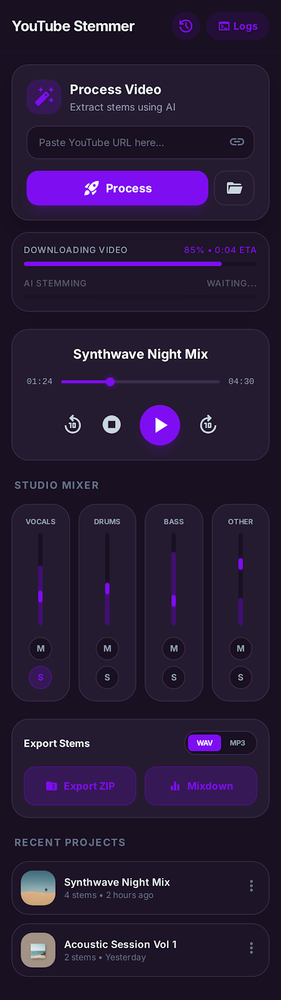

# YouTube Stemmer

[](https://flutter.dev)
[](https://www.rust-lang.org)
[](LICENSE)

A high-performance, cross-platform desktop application for musicians. Retrieve any song from YouTube and split it into individual instrument stems (vocals, drums, bass, etc.) using local AI models.



## 🚀 Features

- **AI Source Separation:** Isolate vocals, drums, bass, and other instruments with high fidelity using the **HTDemucs** model.
- **Smart Metronome:** Automatic BPM estimation and a synchronized metronome with count-in support.
- **Studio Mixer:** Professional multi-track player with real-time Solo/Mute logic and volume controls.
- **Project History:** Keep track of all your processed songs with persistent local storage.
- **High Performance:** Core logic powered by a **Rust** backend and **ONNX Runtime** for fast, local inference.
- **Privacy First:** All processing happens locally on your machine. No audio is ever uploaded to a server.

## 🛠️ Getting Started

### Prerequisites

- **Flutter SDK:** [Install Flutter](https://docs.flutter.dev/get-started/install)
- **Rust Toolchain:** [Install Rust](https://rustup.rs/)
- **ONNX Runtime:** Shared libraries for your platform.

### Quick Build (Linux)

1. **Build the Backend:**
   ```bash
   cd backend
   cargo build --release
   ```

2. **Run the Frontend:**
   ```bash
   cd frontend
   flutter run
   ```

> [!IMPORTANT]
> Detailed build instructions for all platforms (Windows, macOS, Linux, Android, iOS) can be found in [BUILD.md](BUILD.md).

## 📚 Documentation

- [Build Guide](BUILD.md) - Environment setup and compilation steps.
- [macOS Build Notes](README_MAC.md) - Specific steps for Apple Silicon/Intel Universal binaries.
- [Backend Details](backend/README.md) - Rust core and FFI specifications.
- [Frontend Details](frontend/README.md) - Flutter UI architecture and dependencies.

## ⚖️ Legal Disclaimer

This tool is designed for **educational and practice purposes only**. By using this application, you agree to:

1.  Use the retrieved audio strictly for personal, non-commercial use.
2.  Respect the intellectual property rights of the content creators.
3.  Adhere to the [YouTube Terms of Service](https://www.youtube.com/t/terms).

YouTube Stemmer does not host any content. The user is responsible for ensuring they have the legal right to process the audio they retrieve.

## 🤝 Contributing

Contributions are welcome! Please read our [Contributing Guidelines](CONTRIBUTING.md) (coming soon) before submitting a PR.

---

*Made with ❤️ for musicians.*
