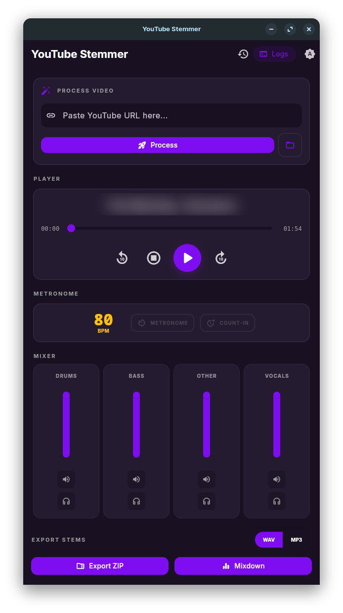

# YouTube Stemmer

[](https://github.com/MrCitron/youtube-stemmer/actions/workflows/build.yml)
[](https://github.com/MrCitron/youtube-stemmer/actions/workflows/release.yml)
[](https://flutter.dev)
[](https://www.rust-lang.org)
[](LICENSE)

A high-performance, cross-platform desktop application for musicians. Retrieve any song from YouTube and split it into individual instrument stems (vocals, drums, bass, etc.) using local AI models.



## 🚀 Features

- **AI Source Separation:** Isolate vocals, drums, bass, and other instruments with high fidelity using the **HTDemucs** model.
- **Smart Metronome (Alpha):** Automatic BPM estimation and a synchronized metronome with count-in support. *Note: Metronome audio is currently non-functional on Linux.*
- **Studio Mixer:** Multi-track player with real-time Solo/Mute logic and volume controls.
- **Project History:** Keep track of all your processed songs with persistent local storage.
- **High Performance:** Core logic powered by a **Rust** backend and **ONNX Runtime** for fast, local inference.
- **Privacy First:** All processing happens locally on your machine. No audio is ever uploaded to a server.

## 🏁 Getting Started

To start using YouTube Stemmer, download the latest version for your platform from the [GitHub Releases](https://github.com/MrCitron/youtube-stemmer/releases) page.

1.  **Download:** Grab the `.tar.gz` (Linux) or `.zip` (macOS) for the latest release.
2.  **Extract:** Unpack the archive to a folder of your choice.
3.  **Run:** Launch the `youtube_stemmer` executable (Linux) or the `.app` bundle (macOS).

> [!TIP]
> **macOS Users:** See the [Troubleshooting](#macos-gatekeeper) section if you encounter security warnings when opening the app.

## 📖 Usage

1.  **Enter URL:** Paste a YouTube link into the search bar and click **Process**.
2.  **Wait for AI:** The app will download the audio and use the HTDemucs model to split it into stems.
3.  **Studio Mixer:** Once processed, use the mixer to Solo or Mute specific tracks (Vocals, Drums, Bass, etc.).
4.  **Smart Metronome:** Enable the metronome to stay in sync. The app automatically estimates the BPM for you!
5.  **Export:** Save your custom mix or individual stems as a ZIP file for use in your favorite DAW.

## 🛠️ Building the application

### Prerequisites

- **Flutter SDK:** [Install Flutter](https://docs.flutter.dev/get-started/install)
- **Rust Toolchain:** [Install Rust](https://rustup.rs/)
- **ONNX Runtime:** Shared libraries for your platform.

### Quick Build (Linux)

1. **Build the Backend:**
   ```bash
   cd backend
   cargo build --release
   ```

2. **Run the Frontend:**
   ```bash
   cd frontend
   flutter run
   ```

> [!IMPORTANT]
> Detailed build instructions for all platforms (Windows, macOS, Linux, Android, iOS) can be found in [BUILD.md](BUILD.md).

## 📚 Documentation

- [Build Guide](BUILD.md) - Environment setup and compilation steps.
- [macOS Build Notes](README_MAC.md) - Specific steps for Apple Silicon/Intel Universal binaries.
- [Backend Details](backend/README.md) - Rust core and FFI specifications.
- [Frontend Details](frontend/README.md) - Flutter UI architecture and dependencies.

## ❓ Troubleshooting

### macOS Gatekeeper
Since the application is not notarized by Apple, you may see a warning saying the app "cannot be opened because the developer cannot be verified" or "is from an unidentified developer."

To authorize the application:
1.  **Locate the app** in your Applications folder (or wherever you extracted it).
2.  **Right-click** (or Control-click) the app icon and select **Open**.
3.  A dialog will appear. Click **Open** again to confirm.
4.  Alternatively, go to **System Settings > Privacy & Security** and scroll down to find the "Open Anyway" button for YouTube Stemmer.

### FFI / Shared Library Errors
If the application fails to start or shows a "Library not found" error:
- Ensure `libbackend` and `libonnxruntime` are in the application directory (or `LD_LIBRARY_PATH` on Linux).
- On macOS, ensure the libraries are correctly embedded and signed in Xcode.

### AI Model Issues
The first time you run the application, it will download the AI models (approx. 300MB).
- Ensure you have an active internet connection.
- If the download fails, check the logs for specific network errors.

### Linux Audio
If the metronome is silent or audio doesn't play:
- Ensure `libmpv` is installed (`sudo apt install libmpv-dev` on Ubuntu/Debian).

## ⚖️ Legal Disclaimer

This tool is designed for **educational and practice purposes only**. By using this application, you agree to:

1.  Use the retrieved audio strictly for personal, non-commercial use.
2.  Respect the intellectual property rights of the content creators.
3.  Adhere to the [YouTube Terms of Service](https://www.youtube.com/t/terms).

YouTube Stemmer does not host any content. The user is responsible for ensuring they have the legal right to process the audio they retrieve.

**Development Note:** This application has been built using **Gemini with Conductor extension**, **Stitch**, and **Claude Code**.

## 🤝 Contributing

Contributions are welcome! Please read our [Contributing Guidelines](CONTRIBUTING.md) (coming soon) before submitting a PR.

---

*Made with ❤️ for musicians by MrCitron.*
